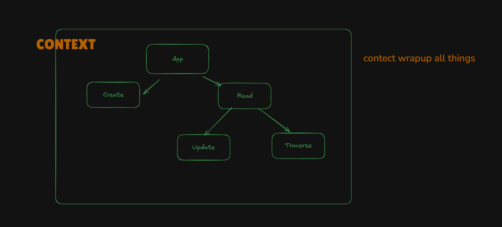

## 🧠 Problem Setup: Props Drilling in a Component Tree

### 🔧 Your Component Structure:

```
App
├── Create
└── Read
    ├── Update
    └── Traverse
```

Imagine we have **some data** or a **state (e.g., `user` or `todos`)** in the `App` component, and we want to access or update it in `Update` or `Traverse`.

### 😩 The Props Drilling Problem:

To get data from `App` to `Update`, we have to pass it like this:

```
App → Read → Update
```

Likewise, for `Traverse`:

```
App → Read → Traverse
```

This means:

* Every intermediate component (`Read`) needs to receive the data **even if it doesn't use it**.
* As the app grows, managing this becomes **painful**, **messy**, and **unscalable**.
* Changing just one prop can break things far away in the tree.

---

## ✅ Solution: Context API

### 🌟 What does Context API do?

> "**Context API provides a way to pass data deeply through the component tree without having to pass props manually at every level.**"

So instead of doing:

```jsx
<App user={user}>
  <Read user={user}>
    <Update user={user} />
  </Read>
</App>
```


We can do this:

### 🧠 "Store once, use anywhere" pattern:

```jsx
// 1. Create a context
export const UserContext = createContext();

// 2. Provide it at the top level
<UserContext.Provider value={user}>
  <App />
</UserContext.Provider>

// 3. Use it wherever needed
const user = useContext(UserContext);
```

No props, no middleman, no repetition. ✨

---

## 📌 Your Description – Rephrased in Pro Style

> In a React application, suppose we have a component hierarchy where `App` is the parent of `Create` and `Read`, and `Read` further contains `Update` and `Traverse`. Now, let’s say we want to share a piece of data (like a user object or a todo list) with both `Update` and `Traverse`. Normally, we’d lift that state up to the highest common parent (`App`) and pass it down using props. But this leads to **props drilling** — passing data through components that don’t need it, just to get it to the ones that do.

> **Context API solves this problem** by allowing us to **create a centralized data store** using `createContext()`, and then use a `Provider` to wrap the parts of the component tree that need access to that data. Components at any depth can then access or update that data using `useContext()` — **no need to go through parent components or manually pass props**.

---

## 🔍 In Simple Terms

* **Without Context API**: You can’t send data directly to grandchild. You must go through parent and child using props.
* **With Context API**: You define the data in a central store, and any component can read or write that data directly.

It’s like:

> 🚚 With props: You’re handing a package from one person to the next.
> 🌐 With Context: You store the package in a locker. Anyone with the key (access to context) can use it.

---


---


### ✅ **Solution to Props Drilling: Context API**

The **solution** to the props drilling problem is **React’s Context API**.

Instead of manually passing data through every intermediate component, the **Context API wraps the part of the component tree** that needs access to shared data and **provides that data globally** within that wrapped section.

### 🔄 How it Works

1. **Create a Context**
   A central store using `createContext()`.

2. **Wrap Your Component Tree with a Provider**
   The `Context.Provider` holds the value you want to share.

3. **Use Data Anywhere**
   Inside any child or grandchild using `useContext()` — no need for props.

---

### 🧩 Final Thought

> **Context API wraps everything and makes the data available wherever needed — clean, scalable, and props-free.**

---

## ❌ Without Context API (Props Drilling)

```
App (owns the data)
│
├── Create
│
└── Read (passes props)
    │
    ├── Update (receives props)
    │
    └── Traverse (receives props)
```

> Data flows from `App` → `Read` → `Update` & `Traverse`
> Even if `Read` doesn’t need the data, it must pass it — **this is props drilling** 😩

---

## ✅ With Context API

```
UserContext.Provider (wraps whole tree, holds shared data)
│
└── App
    │
    ├── Create
    │
    └── Read
        │
        ├── Update (direct access to context)
        │
        └── Traverse (direct access to context)
```

> Now both `Update` and `Traverse` can **access data directly** using `useContext()`
> No need to pass data through `Read` or `App` – this is **Context API power** ⚡

---