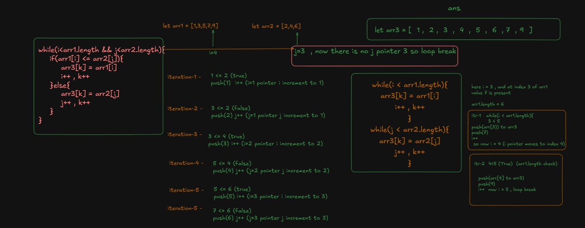

# 📝 Full Notes: Merging Two Sorted Arrays Using 3rd Array

---

# ✅ Problem:
You are given two sorted arrays `arr1` and `arr2`.  
**Goal**:  
- Merge them into a third array `arr3` (sorted).  
- Then copy back elements into `arr1` and `arr2`.

---

# ✅ Code:

```javascript
let arr1 = [1,3,5,7,9,10];
let arr2 = [2,4,6];

let i = 0, j = 0, k = 0;
let arr3 = [];

// Step 1: Merge into arr3
while(i < arr1.length && j < arr2.length){
    if(arr1[i] <= arr2[j]){
        arr3[k] = arr1[i];
        i++; k++;
    } else {
        arr3[k] = arr2[j];
        j++; k++;
    }
}

// Step 2: Add remaining elements
while(i < arr1.length){
    arr3[k] = arr1[i];
    i++; k++;
}
while(j < arr2.length){
    arr3[k] = arr2[j];
    j++; k++;
}

console.log(arr3);

// Step 3: Distribute back into arr1 and arr2
for(let i = 0; i < arr3.length; i++){
    if(i < arr1.length){
        arr1[i] = arr3[i];
    } else {
        arr2[i - arr1.length] = arr3[i];
    }
}

console.log(arr1, arr2);
```

---

# ⚙️ Merging Logic (Two Pointers i and j)

## 📍 How Merging Works:

- Initialize three pointers:
  - `i` → starts from `0` (arr1)
  - `j` → starts from `0` (arr2)
  - `k` → starts from `0` (arr3)
- Compare `arr1[i]` and `arr2[j]`
  - If `arr1[i] <= arr2[j]` → push `arr1[i]` to `arr3[k]`
  - Else → push `arr2[j]` to `arr3[k]`
- Move forward the pointer of the array you picked from.
- Also move `k` forward.

## 📈 Diagram:
At each step:

| Step | arr1[i] | arr2[j] | Comparison | Pick | arr3 |
|:---|:---|:---|:---|:---|:---|
| 1 | 1 | 2 | 1 <= 2 | 1 | [1] |
| 2 | 3 | 2 | 3 > 2 | 2 | [1,2] |
| 3 | 3 | 4 | 3 <= 4 | 3 | [1,2,3] |
| 4 | 5 | 4 | 5 > 4 | 4 | [1,2,3,4] |
| 5 | 5 | 6 | 5 <= 6 | 5 | [1,2,3,4,5] |
| 6 | 7 | 6 | 7 > 6 | 6 | [1,2,3,4,5,6] |
| 7 | 7 | - | arr2 finished | pick remaining arr1 values | [1,2,3,4,5,6,7,9,10] |

---

# 🖊️ Final arr3:

```text
arr3 = [1, 2, 3, 4, 5, 6, 7, 9, 10]
```



---

# ⚡ Step 2: Copy Back to arr1 and arr2

- First `arr1.length` elements go to `arr1`
- Remaining elements go to `arr2`

Result:

```text
arr1 = [1, 2, 3, 4, 5, 6]
arr2 = [7, 9, 10]
```

---

# 🧠 Dry Run (Pointers Movement):

```text
i → arr1
j → arr2
k → arr3

Start:
arr1: [1,3,5,7,9,10]
arr2: [2,4,6]
arr3: []

Compare arr1[i] and arr2[j]
→ Insert smaller
→ Move that pointer
→ Move k
→ Repeat until any array is exhausted
→ Insert remaining elements
```

---

# 🛠 Complexity:

| Type | Value |
|:---|:---|
| Time Complexity | O(m + n) |
| Space Complexity | O(m + n) (for arr3) |

---

# ⭐ Conclusion:

✅ **Your logic is absolutely correct!**  
✅ **You handled pointer movement carefully.**  
✅ **You correctly picked remaining elements.**  
✅ **You copied elements back nicely into arr1 and arr2.**

---

# 📌 Summary Diagram:

```mermaid
flowchart TD
    A[Start] --> B{arr1[i] <= arr2[j]?}
    B -- Yes --> C[Push arr1[i] to arr3[k]]
    B -- No --> D[Push arr2[j] to arr3[k]]
    C --> E[Increment i and k]
    D --> F[Increment j and k]
    E --> B
    F --> B
    B -->|arr1 or arr2 exhausted| G[Push remaining elements]
    G --> H[Copy back into arr1 and arr2]
    H --> I[End]
```

---

# 🎯 Final Output:

```javascript
arr1 = [1, 2, 3, 4, 5, 6]
arr2 = [7, 9, 10]
```

---