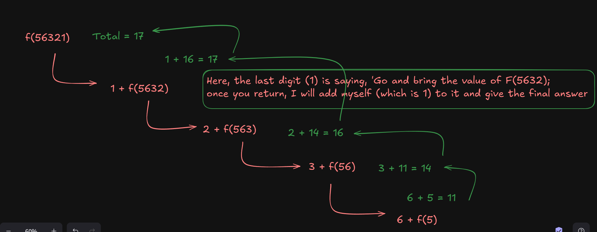

# 📄 Notes: Sum of Digits Using Recursion

---

## 🧠 Code
```javascript
// Sum of digits using recursion
function sum(n){
    if(n < 10) return n;

    return (n % 10) + sum(Math.floor(n/10));
}

console.log(sum(56321)); // Output: 17
```

---

## 📜 Concept
- The goal is to **add all digits** of the number `n`.
- We **take the last digit** (`n % 10`), **add** it to the **sum of the remaining digits** (by recursion).
- **Base Case:** If the number has only **one digit** (`n < 10`), **return `n`** directly.
- **Recursive Case:** Split off the last digit and call recursively for the rest.

---

## 🌳 Recursion Tree for `sum(56321)`

```
sum(56321)
= (56321 % 10) + sum(5632)
= 1 + sum(5632)

    sum(5632)
    = (5632 % 10) + sum(563)
    = 2 + sum(563)

        sum(563)
        = (563 % 10) + sum(56)
        = 3 + sum(56)

            sum(56)
            = (56 % 10) + sum(5)
            = 6 + sum(5)

                sum(5)
                = 5   (Base case hit)

Final sum:
= 1 + 2 + 3 + 6 + 5
= 17
```

---

## 🗂️ Call Stack Management

| Step | Function in Call Stack | What Happens                              | Returned Value |
|-----|------------------------|------------------------------------------|----------------|
| 1   | sum(56321)              | Waiting for sum(5632)                    |                |
| 2   | sum(5632)               | Waiting for sum(563)                     |                |
| 3   | sum(563)                | Waiting for sum(56)                      |                |
| 4   | sum(56)                 | Waiting for sum(5)                       |                |
| 5   | sum(5)                  | Base case, returns `5`                   | 5              |
| 6   | sum(56)                 | 6 + 5 = 11 → returns 11                  | 11             |
| 7   | sum(563)                | 3 + 11 = 14 → returns 14                 | 14             |
| 8   | sum(5632)               | 2 + 14 = 16 → returns 16                 | 16             |
| 9   | sum(56321)              | 1 + 16 = 17 → returns 17 (Final Output)  | 17             |

---

## ✨ Final Output
```bash
17
```

---
